# Roadmap for V2 release

## Tasks

[] Move all commands to skills format, in order to properly support all installers
[] Add support for vercel skill installer - but left support for installers that exists now
[] Publish skills in vercel marketplace
[x] Migrate SDD plugin to v2 version
    [x] Fix issues with scratchpad id generation - potentially write script for generation of them
    [x] switch to `git mv` instead of `mv` in order to keep git history clean and avoid conflicts.
    [x] Write a script that create folder setup and adds scratchpad folder to gitignore
    [x] Add support for flags of `/implementaion` command that allow to increase and decreate amount of guality, amount of iterations allowed, `--human-in-the-loop` flag to allow to pause for human verification after each step and `--refine` flag that will perform refinement of implementation after human feedback or corrections. Need check whether it have `--continue` flag, it not then add it.
    [x] Increase amount of maximum iteration to 3 for planing and 3-4 for implementation phase -> Decided to keep iterations unlimited for now.
[] Update project readme with new features and changes. Remove majoirty of content and move it to docs/, also verify with another projects on best practices of readme. And update header image to be transparent.

## In consideration for V2.1

SDD plugin:
    [] potentially add plan-directly command that allow to plan without using subagents

## In consideration for V3

Possible to create `workflow.yaml` file that will be used to define local pipeline for code development with quality gates and LLM-as-Judge verification. Main focus should be on quality gates they can include:

- Tests with plugin for minimal code coverage and mutation testing. For example if tests not pass 80% coverage it should be returned to coding agent with comment: "Tests coverage is not enough. Please increase coverage to 80% or higher. If writing tests for this code is to complicated, consider refactoring it for better testability and using dependency injection pattern."
- Linting with default integrations with eslint, prettier, tslint, etc. That marks all warninigs as errors, tryies to autofix them and if it fails ask agent to do it.
- Build or compilation test using npm build, tsc, docker build, bun build, etc. With potentially marking warnings as errors and trying to autofix them.
- Security audit using tools like npm audit, tslint audit, etc. With potentially marking warnings as errors and trying to autofix them.
- Code quality search as ast-grep, jscpd, super-linter and MegaLinter (it designed as github action that supports almost all linters for all frameworks, but will be good to use it as code quality check locally), etc.
- Static code analysis using tools like SonarQube, CodeFactor, Codacy, etc. Need check which of them free (Codacy looks like that) and enable it by default
- Dependency and dead code analysis using tools like knip, depcheck, etc.
- Code complexity analysis using tools like cloc/scc (define maximum allowed lines of code per file, per function, per class), or other code complexity metrics. (Mental complexity, cyclomatic complexity, etc.)
- Human-in-the-loop verification after each or specific steps of the process.

[] Possible to add ast-grep support for code-base impact analysis step. Or even as mcp toof for all agents. Or as part of code quality workflow. It allow to search, lint and rewrite code. And allow to write liniting rules using yaml!
[] jscpd allow to detected code dublication and support 150 languages.

## Draft announce for V2

> SDD plugin was rewritten from sctratch. It now able to achive working code aligned with initial prompt in 100% of cases that was tested on real-life production projects!

## Darft desciption of SDD v2

SDD Plugin: Spec-Driven Development + Continuous Learning + LLM-as-Judge

This pluging is designed to consistently produce highest possible quality of solution that LLM agent can produce. Esentially it allow to predictably get results that as close as possible to LLMs benchmark that you using.

Main patterns that implemented in this plugin:

- Multi-agent orcestration for context managment
- Structured reasoning templates, that include: Zero-shot and Few-shot Chain of Thought, Tree of Thoughts, Problem Decomposition and Self-Critique. Each tailored for specific agent and task that they perform.
- Quality gates based on LLM-as-Judge, that are used to evaluate the quality of each planing and implementation step using evidence-based scoring and predefined rubrics.
- Continuous learning agent pattern used in order to build skills that agent will need in order to implement specific task.
- Spec-driven development pattern based on arc42 specification standard adjusted for LLM capabilities and implemented as structured task planing process.

Features and differences from other frameworks, plugins and agentic orcestrators:

- This plugin was able to generate working code aligned with initial prompt in 100% of cases that was tested on real projects. So, if you was able to get use case that it was not able to handle, please report it as an issue.
- Main limitation of this workflow is amount of tokens that you willing to spend on each task. Plugin tries to use as much tokens as possible in order to get best results. Within reasonable default limitations. In order to overcome this limitation, each command have predefined parameters that you can configure to balance between quality and speed. For example you can use `--fast` in `/plan` command in order to limit amount of steps, decrease target quality and amount of refinement iterations. On the other hand, you can increase expected result if you wiling to spend more tokens, by using commands like `--target-quality 4.5 --max-iterations 5` that will allow agent iterate more in order to get close to "ideal" results.
- This plugin is not "vibe" coding solution. It expect that developer that using it know what he want to produce and have some level of understanding how to reach there. So he can incorporate critical information and valuable feedback into the process. But by default it is designed to work from single prompt till the end of the task and make evidence based decisions. Because developer time is more valuable than model time. So it will allways produce working results, but quality of it will be sub-optimal if no human feedback is provided.
- Need keep in mind that plugin can produce results that better than model can generate theoretically, which mainly depend on amount of time that you willing to spend refining it. Specifically, after generating specification you can correct it or left comments using `//` and then running `/plan --refine` command again. You also can make verifications after each planinig and implementation phase. By majority of known researches human feedback is most effective way to improve results.
- Our tests showed that even if speicifcation that was generated initially wasn't correct due to lack of information or complexity of the task. Agent will be able correct itself till it reaches working solution. But usally it means that it will stop more frequiently. To avoid such cases we strongly advice to decompose task into smaller separate tasks with dependencies and review specification for each of them. On the other hand, you still can use plugin even for complex tasks, without human verification, but you probably will be need to use tools like ralp-loop in order to keep agent working for longer time.
- This plugin follows princeple of KISS (Keep It Simple Stupid). So it not yet support epics and roadmaps, because it currently problematic to keep model focused on such long term activities. But it already possible to reach simular results by using `/add-task` command with specifying dependencies between tasks. This way you can produce naturally hierarchial structure of tasks that builds into roadmap. On top of that you can manage and define own process to organaize tasks that more suitable for you and your team.
- While majority of other frameworks, work best for new projects and greenfield development.This plugin designed to work better the more code you already have and the better structured architecture of your solution. At each planing phase it have **codebase impact analysis** step, that evaluate which exact files cab be affected by your tasks and what patterns better to follow in order to achive desired result.
- Plugin designed to work as "night build" for your development process. You can write prompt and let it work while you sleep, and you can expect it to produce working result when you return. The amount of time it will spend depends on task complexity, for simple tasks it can work for 30 minutes, for complex tasks it can workk few days.

### Quick start

```bash
/plugin marketplace add NeoLabHQ/context-engineering-kit
```

Enable `sdd` plugin in marketplace

```bash
/plugin
```

Then run following commands:

```bash
# create .specs/tasks/draft/design-auth-middleware.feature.md file with initial prompt
/add-task "Design and implement authentication middleware with JWT support"

# write detailed specification for the task
/plan
# will move task to .specs/tasks/todo/ folder

# implement the task
/implement
# produce working implementation of the task and move task to .specs/tasks/done/ folder
```

### Detailed guide

Switch model to `sonnet[1m]` in order to keep model focused for longer time. (Important: it not means that sonnet will be used for work itself. By default `sonnet` will be used as orcestrator in order to launch `opus` agent that will perform actual work.)

```bash
/model sonnet[1m]
```

Create tasks file with initial prompt

```bash
/add-task "Design and implement authentication middleware with JWT support"
# Output:
# Created task file: .specs/tasks/draft/design-implement-authentication-middleware-with-jwt-support.feature.md
# Title: Design and implement authentication middleware with JWT support
# Type: feature
# Depends on: None
```

You can adjust task file to incorrporate additional details and creiterias at this moment. But it is not required.

Run planing process

```bash
/plan 
```

It will perform following refinement process in order to update task file with more detailed specification:

```mermaid
flowchart TB
    subgraph Input
        A[📄 Draft Task File<br/>.specs/tasks/draft/*.md]
    end

    subgraph Phase2["Phase 2: Parallel Analysis"]
        direction LR
        B1[🔬 Research<br/>researcher · sonnet]
        B2[📂 Codebase Analysis<br/>code-explorer · sonnet]
        B3[💼 Business Analysis<br/>business-analyst · opus]
        
        J1[⚖️ Judge 2a]
        J2[⚖️ Judge 2b]
        J3[⚖️ Judge 2c]
        
        B1 --> J1
        B2 --> J2
        B3 --> J3
    end

    subgraph Phase3["Phase 3: Architecture Synthesis"]
        C[🏗️ Architecture Synthesis<br/>software-architect · opus]
        JC[⚖️ Judge 3]
        C --> JC
    end

    subgraph Phase4["Phase 4: Decomposition"]
        D[📋 Decomposition<br/>tech-lead · opus]
        JD[⚖️ Judge 4]
        D --> JD
    end

    subgraph Phase5["Phase 5: Parallelize"]
        E[🔀 Parallelize Steps<br/>team-lead · opus]
        JE[⚖️ Judge 5]
        E --> JE
    end

    subgraph Phase6["Phase 6: Verifications"]
        F[✅ Define Verifications<br/>qa-engineer · opus]
        JF[⚖️ Judge 6]
        F --> JF
    end

    subgraph Output
        G[📄 Refined Task File<br/>.specs/tasks/todo/*.md]
        H[📚 Skill File<br/>.claude/skills/*/SKILL.md]
        I[📊 Analysis File<br/>.specs/analysis/*.md]
    end

    A --> Phase2
    J1 & J2 & J3 --> Phase3
    JC --> Phase4
    JD --> Phase5
    JE --> Phase6
    JF --> G & H & I

    style A fill:#e1f5fe
    style G fill:#c8e6c9
    style H fill:#c8e6c9
    style I fill:#c8e6c9
```



It will output updated task file to `.specs/tasks/todo/design-implement-authentication-middleware-with-jwt-support.feature.md` and create new skills if it is needed. Plus, it will produce scratchpads and verification reports along the way in order to properly thinking and evaluating each step of the process. (you can simply ignore them).

At this moment you can verify specification and adjust, and then run `/plan --refine` command again in order to agent to update rest of the specification if it not aligned with your cahgnes. By default it uses top-to-bottom approach to update specification, which means that all sections below your changes will be rethinked and updated accordingly.

Once you are happy with specification, you can run implementation process

```bash
/implement
```

It will perform following actions:


It will automatically write tests and verify them, verify build and that solution is working as expected.

Once implementation is complete, you can verify it and adjust, and then run `/implement --refine` command again in order to agent to update rest of the implementation if it not aligned with your cahgnes or feedback.

Once it complete, you can use `context-engineering-kit:git` plugin in order to commit changes and create pull request.

```bash
/git:commit
/git:create-pr
```

### Overall flow

- `/sdd:add-task` -> produce `.specs/tasks/draft/<task-name>.<type>.md` file with initial task description.
- `/sdd:plan` -> produce `.claude/skills/<skill-name>/SKILL.md` file with skill description and specification. And update task file with refined task description and specification, then move it to `.specs/tasks/todo/` folder.
- `/sdd:implement` -> produce working implementation of the task and verify it, then move it to `.specs/tasks/done/` folder.
- `/git:commit` -> commit changes
- `/git:create-pr` -> create pull request

```mermaid
flowchart LR
    subgraph Create["1. Create"]
        A["/sdd:add-task"]
    end

    subgraph Plan["2. Plan"]
        B["/sdd:plan"]
    end

    subgraph Implement["3. Implement"]
        C["/sdd:implement"]
    end

    subgraph Ship["4. Ship"]
        D["/git:commit"]
        E["/git:create-pr"]
    end

    subgraph Files["Task Lifecycle"]
        F1[📄 draft/*.md]
        F2[📄 todo/*.md]
        F3[📄 in-progress/*.md]
        F4[📄 done/*.md]
    end

    A --> F1
    F1 --> B
    B --> F2
    F2 --> C
    C --> F3
    F3 --> F4
    F4 --> D --> E

    style F1 fill:#ffecb3
    style F2 fill:#e1f5fe
    style F3 fill:#fff3e0
    style F4 fill:#c8e6c9
```


