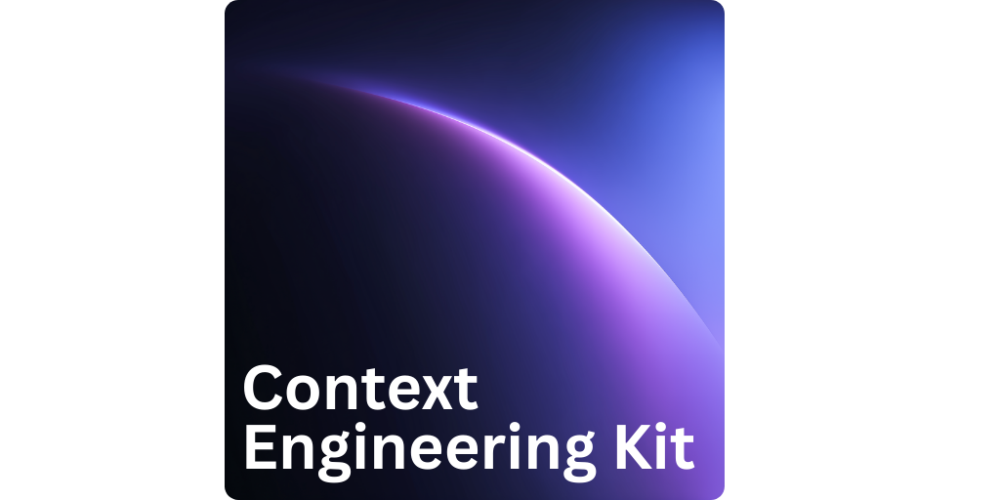

<p align="center">
  <a href="https://cek.neolab.finance/" target="blank"></a>
</p>

<div align="center">

[](LICENSE)
[](https://agentskills.io)
[](https://github.com/hesreallyhim/awesome-claude-code)

Advanced context engineering techniques and patterns for Claude Code, OpenCode, Cursor and more.

[Quick Start](#quick-start) · [Plugins](#plugins-list) · [Github Action](https://cek.neolab.finance/guides/ci-integration) · [Reference](https://cek.neolab.finance/reference) · [Docs](https://cek.neolab.finance/)

</div>

# [Context Engineering Kit](https://cek.neolab.finance)

Hand-crafted collection of advanced context engineering techniques and patterns with minimal token footprint, focused on improving agent result quality and predictability.

The marketplace is based on prompts used daily by our company developers for a long time, while adding plugins from benchmarked papers and high-quality projects.

> [!IMPORTANT]
> **v2 marketplace release:** [Spec-Driven Development plugin](https://cek.neolab.finance/plugins/sdd) was rewritten from sctratch. It is now able to produce working code in 100% of cases on real-life production projects!

## Key Features

- **Simple to Use** - Easy to install and use without any dependencies. Contains automatically used skills and self-explanatory commands.
- **Token-Efficient** - Carefully crafted prompts and architecture, preferring command oriented skills with sub-agents over general information skills when possible, to minimize populating context with unnecessary information.
- **Quality-Focused** - Each plugin is focused on meaningfully improving agent results in a specific area.
- **Granular** - Install only the plugins you need. Each plugin loads only its specific agents, commands, and skills. Each without overlap and redundant skills.
- **Scientifically proven** - Plugins are based on proven techniques and patterns that were tested by well-trusted benchmarks and studies.
- **Open-Standards** - Skills are based on [agentskills.io](https://agentskills.io) and [openskills](https://github.com/numman-ali/openskills). [SDD](https://cek.neolab.finance/plugins/sdd) plugin is based on Arc42 specification standard for software development documentation.

## Quick Start

### Step 1: Install Marketplaces and Plugin

#### Claude Code

Open Claude Code and add the Context Engineering Kit marketplace

```bash
/plugin marketplace add NeoLabHQ/context-engineering-kit
```

This makes all plugins available for installation, but does not load any agents or skills into your context.

Install any plugins, for example reflexion

```bash
/plugin install reflexion@NeoLabHQ/context-engineering-kit
```

Each installed plugin loads only its specific agents, commands, and skills into Claude's context.

<details>
<summary>Installation for Cursor, Windsurf, Cline, OpenCode and others</summary>

Use [OpenSkills](https://github.com/numman-ali/openskills) to install skills for broad range of agents:

```bash
npx openskills install NeoLabHQ/context-engineering-kit
npx openskills sync
```

</details>

### Step 2: Use Plugin

```bash
> claude "implement user authentication"
# Claude implements user authentication, then you can ask it to reflect on implementation

> /reflexion:reflect
# It analyses results and suggests improvements
# If issues are obvious, it will fix them immediately
# If they are minor, it will suggest improvements that you can respond to
> fix the issues

# If you would like it to avoid issues that were found during reflection to appear again,
# ask claude to extract resolution strategies and save the insights to project memory
> /reflexion:memorize
```

Alternatively, you can use the `reflect` word in the initial prompt:

```bash
> claude "implement user authentication, then reflect"
# Claude implements user authentication,
# then hook automatically runs /reflexion:reflect
```

In order to use this hook, you need to have `bun` installed. However, it is not required for the overall command.

## Documentation

You can find the complete Context Engineering Kit documentation [here](https://cek.neolab.finance).

But main plugin we recommend to start with is [Spec-Driven Development](https://cek.neolab.finance/plugins/sdd).

## [Spec-Driven Development](https://cek.neolab.finance/plugins/sdd)

Comprehensive specification-driven development workflow plugin that transforms prompts into production-ready implementations through structured planning, architecture design, and quality-gated execution.

This plugin is designed to consistently and reproducibly produce working code. It was tested on real-life production projects by our team, and in 100% of cases it generated working code aligned with the initial prompt. If you find a use case it cannot handle, please report it as an issue.

#### Key Features

- **Development as compilation** — The plugin works like a "compilation" or "nightly build" for your development process: `task specs → run /sdd:implement → working code`. After writing your prompt, you can launch the plugin and expect a working result when you come back. The time it takes depends on task complexity — simple tasks may finish in 30 minutes, while complex ones can take a few days.
- **Benchmark-level quality in real life** — Model benchmarks improve with each release, yet real-world results usually stay the same. That's because benchmarks reflect the best possible output a model can achieve, whereas in practice LLMs tend to drift toward sub-optimal solutions that can be wrong or non-functional. This plugin uses a variety of patterns to keep the model working at its peak performance.
- **Customizable** — Balance between result quality and process speed by adjusting command parameters. Learn more in the [Customization](./customization.md) section.
- **Developer time-efficient** — The overall process is designed to minimize developer time and reduce the number of interactions, while still producing results better than what a model can generate from scratch. However, overall quality is highly proportional to the time you invest in iterating and refining the specification.
- **Industry-standard** — The plugin's specification template is based on the arc42 standard, adjusted for LLM capabilities. Arc42 is a widely adopted, high-quality standard for software development documentation used by many companies and organizations.
- **Works best in complex or large codebases** — While most other frameworks work best for new projects and greenfield development, this plugin is designed to perform better the more existing code and well-structured architecture you have. At each planning phase it includes a **codebase impact analysis** step that evaluates which files may be affected and which patterns to follow to achieve the desired result.
- **Simple** — This plugin avoids unnecessary complexity and mainly uses just 3 commands, offloading process complexity to the model via multi-agent orchestration. `/sdd:implement` is a single command that produces working code from a task specification. To create that specification, you run `/sdd:add-task` and `/sdd:plan`, which analyze your prompt and iteratively refine the specification until it meets the required quality.

#### Quick Start

```bash
/plugin install sdd@NeoLabHQ/context-engineering-kit
```

Then run the following commands:

```bash
# create .specs/tasks/draft/design-auth-middleware.feature.md file with initial prompt
/sdd:add-task "Design and implement authentication middleware with JWT support"

# write detailed specification for the task
/sdd:plan
# will move task to .specs/tasks/todo/ folder
```

Restart the Claude Code session to clear context and start fresh. Then run the following command:

```bash
# implement the task
/sdd:implement @.specs/tasks/todo/design-auth-middleware.feature.md
# produces working implementation and moves the task to .specs/tasks/done/ folder
```

- [Detailed guide](https://cek.neolab.finance/guides/spec-driven-development)
- [Usage Examples](https://cek.neolab.finance/plugins/sdd/usage-examples)

**Commands**

- [/sdd:add-task](https://cek.neolab.finance/plugins/sdd/add-task.md) - Create task template file with initial prompt
- [/sdd:plan](https://cek.neolab.finance/plugins/sdd/plan.md) - Analyze prompt, generate required skills and refine task specification
- [/sdd:implement](https://cek.neolab.finance/plugins/sdd/implement.md) - Produce working implementation of the task and verify it

Additional commands useful before creating a task:

- [/sdd:create-ideas](https://cek.neolab.finance/plugins/sdd/create-ideas.md) - Generate diverse ideas on a given topic using creative sampling techniques
- [/sdd:brainstorm](https://cek.neolab.finance/plugins/sdd/brainstorm.md) - Refine vague ideas into fully-formed designs through collaborative dialogue

**Agents**

| Agent | Description | Used By |
|-------|-------------|---------|
| `researcher` | Technology research, dependency analysis, best practices | `/sdd:plan` (Phase 2a) |
| `code-explorer` | Codebase analysis, pattern identification, architecture mapping | `/sdd:plan` (Phase 2b) |
| `business-analyst` | Requirements discovery, stakeholder analysis, specification writing | `/sdd:plan` (Phase 2c) |
| `software-architect` | Architecture design, component design, implementation planning | `/sdd:plan` (Phase 3) |
| `tech-lead` | Task decomposition, dependency mapping, risk analysis | `/sdd:plan` (Phase 4) |
| `team-lead` | Step parallelization, agent assignment, execution planning | `/sdd:plan` (Phase 5) |
| `qa-engineer` | Verification rubrics, quality gates, LLM-as-Judge definitions | `/sdd:plan` (Phase 6) |
| `developer` | Code implementation, TDD execution, quality review, verification | `/sdd:implement` |
| `tech-writer` | Technical documentation writing, API guides, architecture updates, lessons learned | `/sdd:implement` |


## Plugins List

To view all available plugins:

```bash
/plugin
```

- [Reflexion](https://cek.neolab.finance/plugins/reflexion) - Introduces feedback and refinement loops to improve output quality.
- [Spec-Driven Development](https://cek.neolab.finance/plugins/sdd) - Introduces commands for specification-driven development, based on Continuous Learning + LLM-as-Judge + Agent Swarm. Achives **development as compilation** through reliable code generation.
- [Code Review](https://cek.neolab.finance/plugins/code-review) - Introduces codebase and PR review commands and skills using multiple specialized agents.
- [Git](https://cek.neolab.finance/plugins/git) - Introduces commands for commit and PRs creation.
- [Test-Driven Development](https://cek.neolab.finance/plugins/tdd) - Introduces commands for test-driven development, common anti-patterns and skills for testing using subagents.
- [Subagent-Driven Development](https://cek.neolab.finance/plugins/sadd) - Introduces skills for subagent-driven development, dispatches fresh subagent for each task with code review between tasks, enabling fast iteration with quality gates.
- [Domain-Driven Development](https://cek.neolab.finance/plugins/ddd) - Introduces commands to update CLAUDE.md with best practices for domain-driven development, focused on code quality, and includes Clean Architecture, SOLID principles, and other design patterns.
- [FPF - First Principles Framework](https://cek.neolab.finance/plugins/fpf) - Introduces structured reasoning using ADI cycle (Abduction-Deduction-Induction) with knowledge layer progression. Uses workflow command pattern with fpf-agent for hypothesis generation, verification, and auditable decision-making.
- [Kaizen](https://cek.neolab.finance/plugins/kaizen) - Inspired by Japanese continuous improvement philosophy, Agile and Lean development practices. Introduces commands for analysis of root causes of issues and problems, including 5 Whys, Cause and Effect Analysis, and other techniques.
- [Customaize Agent](https://cek.neolab.finance/plugins/customaize-agent) - Commands and skills for writing and refining commands, hooks, and skills for Claude Code. Includes Anthropic Best Practices and [Agent Persuasion Principles](https://arxiv.org/abs/2508.00614) that can be useful for sub-agent workflows.
- [Docs](https://cek.neolab.finance/plugins/docs) - Commands for analyzing projects, writing and refining documentation.
- [Tech Stack](https://cek.neolab.finance/plugins/tech-stack) - Commands for setting up or updating CLAUDE.md file with best practices for specific languages or frameworks.
- [MCP](https://cek.neolab.finance/plugins/mcp) - Commands for setting up well-known MCP server integration if needed and updating CLAUDE.md file with requirements to use this MCP server for the current project.

### [Reflexion](https://cek.neolab.finance/plugins/reflexion)

Collection of commands that force the LLM to reflect on previous response and output. Includes **automatic reflection hooks** that trigger when you include "reflect" in your prompt.

**How to install**

```bash
/plugin install reflexion@NeoLabHQ/context-engineering-kit
```

**Commands**

- [/reflexion:reflect](https://cek.neolab.finance/plugins/reflexion/reflect.md) - Reflect on previous response and output, based on Self-refinement framework for iterative improvement with complexity triage and verification
- [/reflexion:memorize](https://cek.neolab.finance/plugins/reflexion/memorize.md) - Memorize insights from reflections and update the CLAUDE.md file with this knowledge. Curates insights from reflections and critiques into CLAUDE.md using Agentic Context Engineering
- [/reflexion:critique](https://cek.neolab.finance/plugins/reflexion/critique.md) - Comprehensive multi-perspective review using specialized judges with debate and consensus building

**Hooks**

- **Automatic Reflection Hook** - Triggers `/reflexion:reflect` automatically when "reflect" appears in your prompt

### [Code Review](https://cek.neolab.finance/plugins/code-review)

Comprehensive code review commands using multiple specialized agents for thorough code quality evaluation.

**How to install**

```bash
/plugin install code-review@NeoLabHQ/context-engineering-kit
```

**Commands**

- [/code-review:review-local-changes](https://cek.neolab.finance/plugins/code-review/review-local-changes.md) - Comprehensive review of local uncommitted changes using specialized agents with code improvement suggestions
- [/code-review:review-pr](https://cek.neolab.finance/plugins/code-review/review-pr.md) - Comprehensive pull request review using specialized agents

**Agents**

This plugin uses multiple specialized agents for comprehensive code quality analysis:

- **bug-hunter** - Identifies potential bugs, edge cases, and error-prone patterns
- **code-quality-reviewer** - Evaluates code structure, readability, and maintainability
- **contracts-reviewer** - Reviews interfaces, API contracts, and data models
- **historical-context-reviewer** - Analyzes changes in relation to codebase history and patterns
- **security-auditor** - Identifies security vulnerabilities and potential attack vectors
- **test-coverage-reviewer** - Evaluates test coverage and suggests missing test cases

You can use this plugin to review code in github actions, in order to do it follow [this guide](https://cek.neolab.finance/guides/ci-integration).

### [Git](https://cek.neolab.finance/plugins/git)

Commands and skills for streamlined Git operations including commits, pull request creation, and advanced workflow patterns.

**How to install**

```bash
/plugin install git@NeoLabHQ/context-engineering-kit
```

**Commands**

- [/git:commit](https://cek.neolab.finance/plugins/git/commit.md) - Create well-formatted commits with conventional commit messages and emoji
- [/git:create-pr](https://cek.neolab.finance/plugins/git/create-pr.md) - Create pull requests using GitHub CLI with proper templates and formatting
- [/git:analyze-issue](https://cek.neolab.finance/plugins/git/analyze-issue.md) - Analyze a GitHub issue and create a detailed technical specification
- [/git:load-issues](https://cek.neolab.finance/plugins/git/load-issues.md) - Load all open issues from GitHub and save them as markdown files
- [/git:create-worktree](https://cek.neolab.finance/plugins/git/create-worktree.md) - Create git worktrees for parallel development with automatic dependency installation
- [/git:compare-worktrees](https://cek.neolab.finance/plugins/git/compare-worktrees.md) - Compare files and directories between git worktrees
- [/git:merge-worktree](https://cek.neolab.finance/plugins/git/merge-worktree.md) - Merge changes from worktrees with selective checkout, cherry-picking, or patch selection

**Skills**

- **worktrees** - Git worktree commands and workflow patterns for parallel branch development
- **notes** - Git notes commands for attaching non-invasive metadata to commits

### [Test-Driven Development](https://cek.neolab.finance/plugins/tdd)

Commands and skills for test-driven development with anti-pattern detection.

**How to install**

```bash
/plugin install tdd@NeoLabHQ/context-engineering-kit
```

**Commands**

- [/tdd:write-tests](https://cek.neolab.finance/plugins/tdd/write-tests.md) - Systematically add test coverage for local code changes using specialized review and development agents
- [/tdd:fix-tests](https://cek.neolab.finance/plugins/tdd/fix-tests.md) - Fix failing tests after business logic changes or refactoring using orchestrated agents

**Skills**

- **test-driven-development** - Introduces TDD methodology, best practices, and skills for testing using subagents

### [Subagent-Driven Development](https://cek.neolab.finance/plugins/sadd)

Execution framework for competitive generation, multi-agent evaluation, and subagent-driven development with quality gates.

**How to install**

```bash
/plugin install sadd@NeoLabHQ/context-engineering-kit
```

**Commands**

- [/sadd:launch-sub-agent](https://cek.neolab.finance/plugins/sadd/launch-sub-agent.md) - Launch focused sub-agents with intelligent model selection, Zero-shot CoT reasoning, and self-critique verification
- [/sadd:do-and-judge](https://cek.neolab.finance/plugins/sadd/do-and-judge.md) - Execute a single task with implementation sub-agent, independent judge verification, and automatic retry loop until passing
- [/sadd:do-in-parallel](https://cek.neolab.finance/plugins/sadd/do-in-parallel.md) - Execute the same task across multiple independent targets in parallel with context isolation
- [/sadd:do-in-steps](https://cek.neolab.finance/plugins/sadd/do-in-steps.md) - Execute complex tasks through sequential sub-agent orchestration with automatic decomposition and context passing
- [/sadd:do-competitively](https://cek.neolab.finance/plugins/sadd/do-competitively.md) - Execute tasks through competitive generation, multi-judge evaluation, and evidence-based synthesis to produce superior results
- [/sadd:tree-of-thoughts](https://cek.neolab.finance/plugins/sadd/tree-of-thoughts.md) - Execute complex reasoning through systematic exploration of solution space, pruning unpromising branches, and synthesizing the best solution
- [/sadd:judge-with-debate](https://cek.neolab.finance/plugins/sadd/judge-with-debate.md) - Evaluate solutions through iterative multi-judge debate with consensus building or disagreement reporting
- [/sadd:judge](https://cek.neolab.finance/plugins/sadd/judge.md) - Evaluate completed work using LLM-as-Judge with structured rubrics and evidence-based scoring

**Skills**

- [subagent-driven-development](https://cek.neolab.finance/plugins/sadd/subagent-driven-development.md) - Dispatches fresh subagent for each task with code review between tasks, enabling fast iteration with quality gates
- [multi-agent-patterns](https://cek.neolab.finance/plugins/sadd/multi-agent-patterns.md) - Design multi-agent architectures (supervisor, peer-to-peer, hierarchical) for complex tasks exceeding single-agent context limits

### [Domain-Driven Development](https://cek.neolab.finance/plugins/ddd)

Commands for setting up domain-driven development best practices focused on code quality.

**How to install**

```bash
/plugin install ddd@NeoLabHQ/context-engineering-kit
```

**Commands**

- [/ddd:setup-code-formating](https://cek.neolab.finance/plugins/ddd/setup-code-formating.md) - Sets up code formatting rules and style guidelines in CLAUDE.md

**Skills**

- **software-architecture** - Includes Clean Architecture, SOLID principles, and other design patterns

### [FPF - First Principles Framework](https://cek.neolab.finance/plugins/fpf)

A structured reasoning plugin that implements the **[First Principles Framework (FPF)](https://github.com/ailev/FPF)** by Anatoly Levenchuk — a methodology for rigorous, auditable reasoning. The killer feature is turning the black box of AI reasoning into a transparent, evidence-backed audit trail. The plugin makes AI decision-making transparent and auditable. Instead of jumping to solutions, FPF enforces generating competing hypotheses, checking them logically, testing against evidence, then letting developers choose.

Key principles:

- **Transparent reasoning** - Full audit trail from hypothesis to decision
- **Hypothesis-driven** - Generate 3-5 competing alternatives before evaluating
- **Evidence-based** - Computed trust scores, not estimates
- **Human-in-the-loop** - AI generates options; humans decide (Transformer Mandate)

The core cycle follows three modes of inference:

1. **Abduction** — Generate competing hypotheses (don't anchor on the first idea).
2. **Deduction** — Verify logic and constraints (does the idea make sense?).
3. **Induction** — Gather evidence through tests or research (does the idea work in reality?).

Then, audit for bias, decide, and document the rationale in a durable record.

> **Warning:** This plugin loads the core FPF specification into context, which is large (~600k tokens). As a result, it is loaded into a subagent with the Sonnet[1m] model. However, such an agent can consume your token limit quickly.

**How to install**

```bash
/plugin install fpf@NeoLabHQ/context-engineering-kit
```

#### Usage workflow

```bash
# Execute complete FPF cycle from hypothesis to decision
/fpf:propose-hypotheses What caching strategy should we use?

# The workflow will:
# 1. Initialize context and .fpf/ directory
# 2. Generate competing hypotheses
# 3. Allow you to add your own alternatives
# 4. Verify each against project constraints (parallel)
# 5. Validate with evidence (parallel)
# 6. Compute trust scores (parallel)
# 7. Present comparison for your decision
```

**Commands**

- [/fpf:propose-hypotheses](https://cek.neolab.finance/plugins/fpf/propose-hypotheses.md) - Execute complete FPF cycle from hypothesis to decision (main workflow)
- [/fpf:status](https://cek.neolab.finance/plugins/fpf/status.md) - Show current FPF phase and hypothesis counts
- [/fpf:query](https://cek.neolab.finance/plugins/fpf/query.md) - Search knowledge base with assurance info
- [/fpf:decay](https://cek.neolab.finance/plugins/fpf/decay.md) - Manage evidence freshness (refresh/deprecate/waive)
- [/fpf:actualize](https://cek.neolab.finance/plugins/fpf/actualize.md) - Reconcile knowledge with codebase changes
- [/fpf:reset](https://cek.neolab.finance/plugins/fpf/reset.md) - Archive session and return to IDLE

**Agent**

- [fpf-agent](https://cek.neolab.finance/plugins/fpf/fpf-agent.md) - FPF reasoning specialist for hypothesis generation, verification, validation, and trust calculus using ADI cycle and knowledge layer progression

### [Kaizen](https://cek.neolab.finance/plugins/kaizen)

Continuous improvement methodology inspired by Japanese philosophy and Agile practices.

**How to install**

```bash
/plugin install kaizen@NeoLabHQ/context-engineering-kit
```

**Commands**

- [/kaizen:analyse](https://cek.neolab.finance/plugins/kaizen/analyse.md) - Auto-selects best Kaizen method (Gemba Walk, Value Stream, or Muda) for target analysis
- [/kaizen:analyse-problem](https://cek.neolab.finance/plugins/kaizen/analyse-problem.md) - Comprehensive A3 one-page problem analysis with root cause and action plan
- [/kaizen:why](https://cek.neolab.finance/plugins/kaizen/why.md) - Iterative Five Whys root cause analysis drilling from symptoms to fundamentals
- [/kaizen:root-cause-tracing](https://cek.neolab.finance/plugins/kaizen/root-cause-tracing.md) - Systematically traces bugs backward through call stack to identify source of invalid data or incorrect behavior
- [/kaizen:cause-and-effect](https://cek.neolab.finance/plugins/kaizen/cause-and-effect.md) - Systematic Fishbone analysis exploring problem causes across six categories
- [/kaizen:plan-do-check-act](https://cek.neolab.finance/plugins/kaizen/plan-do-check-act.md) - Iterative PDCA cycle for systematic experimentation and continuous improvement

**Skills**

- [kaizen](https://cek.neolab.finance/plugins/kaizen/kaizen.md) - Continuous improvement methodology with multiple analysis techniques

### [Customaize Agent](https://cek.neolab.finance/plugins/customaize-agent)

Commands and skills for creating and refining Claude Code extensions.

**How to install**

```bash
/plugin install customaize-agent@NeoLabHQ/context-engineering-kit
```

**Commands**

- [/customaize-agent:create-agent](https://cek.neolab.finance/plugins/customaize-agent/create-agent.md) - Comprehensive guide for creating Claude Code agents with proper structure, triggering conditions, system prompts, and validation
- [/customaize-agent:create-command](https://cek.neolab.finance/plugins/customaize-agent/create-command.md) - Interactive assistant for creating new Claude commands with proper structure and patterns
- [/customaize-agent:create-workflow-command](https://cek.neolab.finance/plugins/customaize-agent/create-workflow-command.md) - Create workflow commands that orchestrate multi-step execution through sub-agents with file-based task prompts
- [/customaize-agent:create-skill](https://cek.neolab.finance/plugins/customaize-agent/create-skill.md) - Guide for creating effective skills with test-driven approach
- [/customaize-agent:create-hook](https://cek.neolab.finance/plugins/customaize-agent/create-hook.md) - Create and configure git hooks with intelligent project analysis and automated testing
- [/customaize-agent:test-skill](https://cek.neolab.finance/plugins/customaize-agent/test-skill.md) - Verify skills work under pressure and resist rationalization using RED-GREEN-REFACTOR cycle
- [/customaize-agent:test-prompt](https://cek.neolab.finance/plugins/customaize-agent/test-prompt.md) - Test any prompt (commands, hooks, skills, subagent instructions) using RED-GREEN-REFACTOR cycle with subagents
- [/customaize-agent:apply-anthropic-skill-best-practices](https://cek.neolab.finance/plugins/customaize-agent/apply-anthropic-skill-best-practices.md) - Comprehensive guide for skill development based on Anthropic's official best practices

**Skills**

- [prompt-engineering](https://cek.neolab.finance/plugins/customaize-agent/prompt-engineering.md) - Well known prompt engineering techniques and patterns, includes Anthropic Best Practices and Agent Persuasion Principles
- [context-engineering](https://cek.neolab.finance/plugins/customaize-agent/context-engineering.md) - Deep understanding of context mechanics: attention budget, progressive disclosure, lost-in-middle effect, and practical optimization patterns
- [agent-evaluation](https://cek.neolab.finance/plugins/customaize-agent/agent-evaluation.md) - Evaluation frameworks for agent systems: LLM-as-Judge, multi-dimensional rubrics, bias mitigation, and the 95% performance finding

### [Docs](https://cek.neolab.finance/plugins/docs)

Commands for project analysis and documentation management based on proven writing principles.

**How to install**

```bash
/plugin install docs@NeoLabHQ/context-engineering-kit
```

**Commands**

- [/docs:update-docs](https://cek.neolab.finance/plugins/docs/update-docs.md) - Update implementation documentation after completing development phases
- [/docs:write-concisely](https://cek.neolab.finance/plugins/docs/write-concisely.md) - Apply *The Elements of Style* principles to make documentation clearer and more professional

### [Tech Stack](https://cek.neolab.finance/plugins/tech-stack)

Commands for setting up language and framework-specific best practices.

**How to install**

```bash
/plugin install tech-stack@NeoLabHQ/context-engineering-kit
```

**Commands**

- [/tech-stack:add-typescript-best-practices](https://cek.neolab.finance/plugins/tech-stack/add-typescript-best-practices.md) - Setup TypeScript best practices and code style rules in CLAUDE.md

### [MCP](https://cek.neolab.finance/plugins/mcp)

Commands for integrating Model Context Protocol servers with your project. Each setup command supports configuration at multiple levels:

- **Project level (shared)** - Configuration tracked in git, shared with team via `./CLAUDE.md`
- **Project level (personal)** - Local configuration in `./CLAUDE.local.md`, not tracked in git
- **User level (global)** - Configuration in `~/.claude/CLAUDE.md`, applies to all projects

**How to install**

```bash
/plugin install mcp@NeoLabHQ/context-engineering-kit
```

**Commands**

- [/mcp:setup-context7-mcp](https://cek.neolab.finance/plugins/mcp/setup-context7-mcp.md) - Guide for setup Context7 MCP server to load documentation for specific technologies
- [/mcp:setup-serena-mcp](https://cek.neolab.finance/plugins/mcp/setup-serena-mcp.md) - Guide for setup Serena MCP server for semantic code retrieval and editing capabilities
- [/mcp:setup-codemap-cli](https://cek.neolab.finance/plugins/mcp/setup-codemap-cli.md) - Guide for setup Codemap CLI for intelligent codebase visualization and navigation
- [/mcp:setup-arxiv-mcp](https://cek.neolab.finance/plugins/mcp/setup-arxiv-mcp.md) - Guide for setup arXiv/Paper Search MCP server via Docker MCP for academic paper search and retrieval from multiple sources
- [/mcp:build-mcp](https://cek.neolab.finance/plugins/mcp/build-mcp.md) - Guide for creating high-quality MCP servers that enable LLMs to interact with external services

## Theoretical Foundation

This project is based on research and papers from the following sources:

- [Self-Refine](https://arxiv.org/abs/2303.17651) - Core refinement loop
- [Reflexion](https://arxiv.org/abs/2303.11366) - Memory integration
- [Constitutional AI](https://arxiv.org/abs/2212.08073) - Principle-based critique
- [LLM-as-a-Judge](https://arxiv.org/abs/2306.05685) - Evaluation patterns
- [Multi-Agent Debate](https://arxiv.org/abs/2305.14325) - Multiple perspectives
- [Agentic Context Engineering](https://arxiv.org/abs/2510.04618) - Memory curation
- [Chain-of-Verification](https://arxiv.org/abs/2309.11495) - Hallucination reduction
- [Tree of Thoughts](https://arxiv.org/abs/2305.10601) - Structured exploration
- [Process Reward Models](https://arxiv.org/abs/2305.20050) - Step-by-step evaluation
- [Verbalized Sampling](https://arxiv.org/abs/2510.01171) - Diverse idea generation with 2-3x improvement
- [Process Reward Models](https://arxiv.org/abs/2305.20050) - Step verification
- [Chain of Thought Prompting](https://arxiv.org/abs/2201.11903) - Step-by-step reasoning
- [Inference-Time Scaling of Verification](https://arxiv.org/abs/2601.15808) - Rubric-guided verification

More details about theoretical foundation can be found in [resources](https://cek.neolab.finance/resources) page.
