# Reliable Engineering through Spec-Driven Development (SDD)

Structured workflow for features and bugs requiring planning, specifications, and architecture decisions before implementation. Mainly based on the [SDD](../plugins/sdd/README.md) plugin.

For simple features, use [Feature Development with Quality Gates](./feature-development.md) workflow.

## When to Use

- Features requiring complex development
- Significant architectural changes or integrations

## Required Plugins

- [SDD](../plugins/sdd/README.md)
- [Git](../plugins/git/README.md)

## Workflow

### Specification Creation

Optional, but highly recommended to switch the model to `sonnet[1m]` to keep it focused for a longer time.

Important: this does not mean that Sonnet will be used for the work itself. By default, `sonnet` is used as the orchestrator to launch `opus` agents that perform the actual work.

```bash
/model sonnet[1m]
```

Create a task file with the initial prompt:

```bash
/add-task "Design and implement authentication middleware with JWT support"
# Output:
# Created task file: .specs/tasks/draft/design-implement-authentication-middleware-with-jwt-support.feature.md
# Title: Design and implement authentication middleware with JWT support
# Type: feature
# Depends on: None
```

You can adjust the task file to incorporate additional details and criteria at this point, but it is not required.

Run the planning process:

```bash
/plan 
```

It will perform the following refinement process to update the task file with a more detailed specification:

```mermaid
flowchart TB
    subgraph Input
        A[📄 Draft Task File<br/>.specs/tasks/draft/*.md]
    end

    subgraph Phase2["Phase 2: Parallel Analysis"]
        direction LR
        B1[🔬 Research<br/>researcher · sonnet]
        B2[📂 Codebase Analysis<br/>code-explorer · sonnet]
        B3[💼 Business Analysis<br/>business-analyst · opus]
        
        J1[⚖️ Judge 2a]
        J2[⚖️ Judge 2b]
        J3[⚖️ Judge 2c]
        
        B1 --> J1
        B2 --> J2
        B3 --> J3
    end

    subgraph Phase3["Phase 3: Architecture Synthesis"]
        C[🏗️ Architecture Synthesis<br/>software-architect · opus]
        JC[⚖️ Judge 3]
        C --> JC
    end

    subgraph Phase4["Phase 4: Decomposition"]
        D[📋 Decomposition<br/>tech-lead · opus]
        JD[⚖️ Judge 4]
        D --> JD
    end

    subgraph Phase5["Phase 5: Parallelize"]
        E[🔀 Parallelize Steps<br/>team-lead · opus]
        JE[⚖️ Judge 5]
        E --> JE
    end

    subgraph Phase6["Phase 6: Verifications"]
        F[✅ Define Verifications<br/>qa-engineer · opus]
        JF[⚖️ Judge 6]
        F --> JF
    end

    subgraph Output
        G[📄 Refined Task File<br/>.specs/tasks/todo/*.md]
        H[📚 Skill File<br/>.claude/skills/*/SKILL.md]
        I[📊 Analysis File<br/>.specs/analysis/*.md]
    end

    A --> Phase2
    J1 & J2 & J3 --> Phase3
    JC --> Phase4
    JD --> Phase5
    JE --> Phase6
    JF --> G & H & I

    style A fill:#e1f5fe
    style G fill:#c8e6c9
    style H fill:#c8e6c9
    style I fill:#c8e6c9
```



It will output the updated task file to `.specs/tasks/todo/design-implement-authentication-middleware-with-jwt-support.feature.md` and create new skills if needed. It also produces scratchpads and verification reports along the way to properly evaluate each step of the process. You can safely ignore all of them.

At this point you can verify and adjust the specification, then run the `/plan --refine` command again for agents to update the rest of the specification where it doesn't align with your changes. It uses a top-to-bottom approach, meaning all sections below your changes will be rethought and updated accordingly.

### Code Generation

Once you are happy with the specification, you can run the implementation process:

```bash
/implement
```

It will perform the following actions:


It will automatically write tests, verify them, build the solution, and confirm it works as expected.

Once implementation is complete, you can review and adjust it, then run `/implement --refine` again for the agent to update the rest of the implementation if it doesn't align with your changes or feedback.

### Commit and Push

Once complete, you can use the [git](../plugins/git) plugin to commit changes and create a pull request.

```bash
/git:commit
/git:create-pr
```
