# Spec-Driven Development (SDD) Plugin: Continuous Learning + LLM-as-Judge + Agent Swarm

Comprehensive specification-driven development workflow plugin that transforms prompts into production-ready implementations through structured planning, architecture design, and quality-gated execution.

This plugin is designed to consistently and reproducibly produce working code. It was tested on real-life production projects by our team, and in 100% of cases it generated working code aligned with the initial prompt. If you find a use case it cannot handle, please report it as an issue.

## Key Features

- **Development as compilation** — The plugin works like a "compilation" or "nightly build" for your development process: `task specs → run /sdd:implement → working code`. After writing your prompt, you can launch the plugin and expect a working result when you come back. The time it takes depends on task complexity — simple tasks may finish in 30 minutes, while complex ones can take a few days.
- **Benchmark-level quality in real life** — Model benchmarks improve with each release, yet real-world results usually stay the same. That's because benchmarks reflect the best possible output a model can achieve, whereas in practice LLMs tend to drift toward sub-optimal solutions that can be wrong or non-functional. This plugin uses a variety of patterns to keep the model working at its peak performance.
- **Customizable** — Balance between result quality and process speed by adjusting command parameters. Learn more in the [Customization](./customization.md) section.
- **Developer time-efficient** — The overall process is designed to minimize developer time and reduce the number of interactions, while still producing results better than what a model can generate from scratch. But overral quality is highly proportional to the time you invest in iterating and refining the specification.
- **Industry-standard** — The plugin's specification template is based on the arc42 standard, adjusted for LLM capabilities. Arc42 is a widely adopted, high-quality standard for software development documentation used by many companies and organizations.
- **Works best in complex or large codebases** — While most other frameworks work best for new projects and greenfield development, this plugin is designed to improve the more existing code and well-structured architecture you have. At each planning phase it includes a **codebase impact analysis** step that evaluates which files may be affected and which patterns to follow to achieve the desired result.
- **Simple** — This plugin avoids unnecessary complexity and mainly uses just 3 commands, offloading process complexity to the model via multi-agent orchestration. `/sdd:implement` is a single command that produces working code from a task specification. To create that specification, you run `/sdd:add-task` and `/sdd:plan`, which analyze your prompt and iteratively refine the specification until it meets the required quality.

## Quick Start

```bash
/plugin marketplace add NeoLabHQ/context-engineering-kit
```

Enable `sdd` plugin in installed plugins list

```bash
/plugin
# Installed -> sdd -> Space to enable
```

Then run the following commands:

```bash
# create .specs/tasks/draft/design-auth-middleware.feature.md file with initial prompt
/sdd:add-task "Design and implement authentication middleware with JWT support"

# write detailed specification for the task
/sdd:plan
# will move task to .specs/tasks/todo/ folder
```

Restart the Claude Code session to clear context and start fresh. Then run the following command:

```bash
# implement the task
/sdd:implement @.specs/tasks/todo/design-auth-middleware.feature.md
# produces working implementation and moves the task to .specs/tasks/done/ folder
```

- [Detailed guide](../../guides/spec-driven-development.md)
- [Usage Examples](./usage-examples.md)

## Overall Flow

End-to-end task implementation process from initial prompt to pull request, including commands from the [git](../git) plugin:

- `/sdd:add-task` → creates a `.specs/tasks/draft/<task-name>.<type>.md` file with the initial task description.
- `/sdd:plan` → generates a `.claude/skills/<skill-name>/SKILL.md` file with skills needed to implement the task (by analyzing library and framework documentation used in the codebase), then updates the task file with a refined specification and moves it to `.specs/tasks/todo/`.
- `/sdd:implement` → produces a working implementation, verifies it, then moves the task to `.specs/tasks/done/`.
- `/git:commit` → commits changes.
- `/git:create-pr` → creates a pull request.

```mermaid
flowchart LR
    subgraph Create["1. Create"]
        A["/sdd:add-task"]
    end

    subgraph Plan["2. Plan"]
        B["/sdd:plan"]
    end

    subgraph Implement["3. Implement"]
        C["/sdd:implement"]
    end

    subgraph Ship["4. Ship"]
        D["/git:commit"]
        E["/git:create-pr"]
    end

    subgraph Files["Task Lifecycle"]
        F1[📄 draft/*.md]
        F2[📄 todo/*.md]
        F3[📄 in-progress/*.md]
        F4[📄 done/*.md]
    end

    A --> F1
    F1 --> B
    B --> F2
    F2 --> C
    C --> F3
    F3 --> F4
    F4 --> D --> E

    style F1 fill:#ffecb3
    style F2 fill:#e1f5fe
    style F3 fill:#fff3e0
    style F4 fill:#c8e6c9
```



## Commands

Core workflow commands:

- [/sdd:add-task](./add-task.md) - Create task template file with initial prompt
- [/sdd:plan](./plan.md) - Analyze prompt, generate required skills and refine task specification
- [/sdd:implement](./implement.md) - Produce working implementation of the task and verify it

Additional commands useful before creating a task:

- [/sdd:create-ideas](./create-ideas.md) - Generate diverse ideas on a given topic using creative sampling techniques
- [/sdd:brainstorm](./brainstorm.md) - Refine vague ideas into fully-formed designs through collaborative dialogue

## Available Agents

The SDD plugin uses specialized agents for different phases of development:

| Agent | Description | Used By |
|-------|-------------|---------|
| `researcher` | Technology research, dependency analysis, best practices | `/sdd:plan` (Phase 2a) |
| `code-explorer` | Codebase analysis, pattern identification, architecture mapping | `/sdd:plan` (Phase 2b) |
| `business-analyst` | Requirements discovery, stakeholder analysis, specification writing | `/sdd:plan` (Phase 2c) |
| `software-architect` | Architecture design, component design, implementation planning | `/sdd:plan` (Phase 3) |
| `tech-lead` | Task decomposition, dependency mapping, risk analysis | `/sdd:plan` (Phase 4) |
| `team-lead` | Step parallelization, agent assignment, execution planning | `/sdd:plan` (Phase 5) |
| `qa-engineer` | Verification rubrics, quality gates, LLM-as-Judge definitions | `/sdd:plan` (Phase 6) |
| `developer` | Code implementation, TDD execution, quality review, verification | `/sdd:implement` |

## Patterns

Key patterns implemented in this plugin:

- **Structured reasoning templates** — includes Zero-shot and Few-shot Chain of Thought, Tree of Thoughts, Problem Decomposition, and Self-Critique. Each is tailored to a specific agent and task, enabling sufficiently detailed decomposition so that isolated sub-agents can implement each step independently.
- **Multi-agent orchestration for context management** — Context isolation of independent agents prevents the context rot problem, essentially keeping LLMs at optimal performance at each step of the process. The main agent acts as an orchestrator that launches sub-agents and controls their work.
- **Quality gates based on LLM-as-Judge** — Evaluate the quality of each planning and implementation step using evidence-based scoring and predefined verification rubrics. This fully eliminates cases where an agent produces non-working or incorrect solutions.
- **Continuous learning** — Builds skills that the agent needs to implement a specific task, which it would otherwise not be able to perform from scratch.
- **Spec-driven development pattern** — Based on the arc42 specification standard, adjusted for LLM capabilities, to eliminate parts of the specification that add no value to implementation quality or that could degrade it.
- **MAKER** — An agent reliability pattern introduced in [Solving a Million-Step LLM Task with Zero Errors](https://arxiv.org/abs/2511.09030). It removes agent mistakes caused by accumulated context and hallucinations by utilizing clean-state agent launches, filesystem-based memory storage, and multi-agent voting during critical decision-making.

## Vibe Coding vs. Specification-Driven Development

This plugin is not a "vibe coding" solution, but out of the box it works like one. By default it is designed to work from a single prompt through to the end of the task, making reasonable assumptions and evidence-based decisions instead of constantly asking for clarification. This is caused by fact that developer time is more valuable than model time, so it allow developer to decide how much time task is worth to spend. Plugin will always produce working results, but quality will be sub-optimal if no human feedback is provided.

To improve quality, after generating a specification you can correct it or leave comments using `//`, then run the `/plan` command again with the `--refine` flag. You can also verify each planning and implementation phase by adding the `--human-in-the-loop` flag. According to the majority of known research, human feedback is the most effective way to improve results.

Our tests showed that even when the initially generated specification was incorrect due to lack of information or task complexity, the agent was still able to self-correct until it reached a working solution. However, it usually took much longer, spending time on wrong paths and stopping more frequently. To avoid this, we strongly advise decomposing tasks into smaller separate tasks with dependencies and reviewing the specification for each one. You can add dependencies between tasks as arguments to the `/add-task` command, and the model will link them together by adding a `depends_on` section to the task file frontmatter.

Even if you don't want to spend much time on this process, you can still use the plugin for complex tasks without decomposition or human verification — but you will likely need tools like ralph-loop to keep the agent running for a longer time.

Learn more about available customization options in [Customization](./customization.md).

## Theoretical Foundation

The SDD plugin is based on established software engineering methodologies and research:

### Core Methodologies

- [GitHub Spec Kit](https://github.com/github/spec-kit) - Specification-driven development templates and workflows
- [OpenSpec](https://github.com/Fission-AI/OpenSpec) - Open specification format for software requirements
- [BMad Method](https://github.com/bmad-code-org/BMAD-METHOD) - Structured approach to breaking down complex features

### Supporting Research

- [Specification-Driven Development](https://en.wikipedia.org/wiki/Design_by_contract) - Design by contract and formal specification approaches
- [Agile Requirements Engineering](https://www.agilealliance.org/agile101/) - User stories, acceptance criteria, and iterative refinement
- [Test-Driven Development](https://www.agilealliance.org/glossary/tdd/) - Writing tests before implementation
- [Clean Architecture](https://blog.cleancoder.com/uncle-bob/2012/08/13/the-clean-architecture.html) - Separation of concerns and dependency inversion
- [Vertical Slice Architecture](https://jimmybogard.com/vertical-slice-architecture/) - Feature-based organization for incremental delivery
- [Verbalized Sampling](https://arxiv.org/abs/2510.01171) - Training-free prompting strategy for diverse idea generation. Achieves **2-3x diversity improvement** while maintaining quality. Used for `create-ideas`, `brainstorm` and `plan` commands
- [Solving a Million-Step LLM Task with Zero Errors](https://arxiv.org/abs/2511.09030) - Reliability pattern for LLM-based agents that enables solving complex tasks with zero errors.
- [LLM-as-a-Judge](https://arxiv.org/abs/2306.05685) - Evaluation patterns
- [Multi-Agent Debate](https://arxiv.org/abs/2305.14325) - Multiple perspectives
- [Chain-of-Verification](https://arxiv.org/abs/2309.11495) - Hallucination reduction
- [Tree of Thoughts](https://arxiv.org/abs/2305.10601) - Structured exploration
- [Constitutional AI](https://arxiv.org/abs/2212.08073) - Project constitution
- [Chain of Thought Prompting](https://arxiv.org/abs/2201.11903) - Step-by-step reasoning
