# /sdd:add-task - Draft Task Creation

Create a draft task file that captures the user's intent with structured metadata, proper classification, and dependency tracking — ready for refinement by `/sdd:plan`.

- Purpose — Transform a user prompt into a well-structured draft task file with action-oriented title, type classification, and optional dependencies
- Output — Task file in `.specs/tasks/draft/<name>.<type>.md`

```bash
/sdd:add-task "Task description" [dependency-file-paths...]
```

## Arguments

| Argument | Format | Default | Description |
|----------|--------|---------|-------------|
| `description` | String | **Required** | Task title or description (e.g., `"Add validation to form inputs"`) |
| `dependencies` | Path(s) | None | One or more task file paths this task depends on (e.g., `.specs/tasks/draft/implement-auth.feature.md`) |

## Workflow Diagram

```mermaid
flowchart TB
    subgraph Input
        A[💬 User Prompt]
        B[📄 Dependencies]
    end

    subgraph Phase1[Phase 1: Setup]
        C[📁 Ensure Directory Structure]
    end

    subgraph Phase2[Phase 2: Analyze]
        D[🔍 Parse User Request]
        E[🏷️ Classify Type]
        F[✏️ Create Action-Oriented Title]
    end

    subgraph Phase3[Phase 3: Generate]
        G[📝 Generate File Name]
        H[🔎 Verify Uniqueness]
        I[💾 Write Task File]
    end

    subgraph Output
        J[📄 Draft Task File]
    end

    A & B --> Phase1
    Phase1 --> Phase2
    D --> E --> F
    Phase2 --> Phase3
    G --> H --> I
    Phase3 --> Output

    style A fill:#e1f5fe
    style J fill:#c8e6c9
```



## How It Works

### Phase 1: Setup Directory Structure

Creates the full task lifecycle directory structure if it doesn't exist:

| Directory | Purpose |
|-----------|---------|
| `.specs/tasks/draft/` | New tasks awaiting analysis |
| `.specs/tasks/todo/` | Tasks ready to implement |
| `.specs/tasks/in-progress/` | Currently being worked on |
| `.specs/tasks/done/` | Completed tasks |
| `.specs/scratchpad/` | Temporary working files (gitignored) |

### Phase 2: Analyze Input

1. **Parse the user request** — extracts the core objective, identifies implied type, and notes any provided dependencies
2. **Classify type** — determines the appropriate task type based on the description:

| Type | Use When |
|------|----------|
| `feature` | New functionality or capability |
| `bug` | Something is broken or not working correctly |
| `refactor` | Code restructuring without changing behavior |
| `test` | Adding or updating tests |
| `docs` | Documentation changes only |
| `chore` | Maintenance tasks, dependency updates |
| `ci` | CI/CD configuration changes |

1. **Create title** — generates an action-oriented title starting with a verb (Add, Fix, Update, Implement, Remove, Refactor)

### Phase 3: Generate Task File

1. **Generate file name** from the title:
   - Lowercase, hyphen-separated, 3-5 words max
   - Appended with type extension: `<short-name>.<type>.md`
   - Example: `"Add validation to login form"` → `add-validation-login-form.feature.md`

2. **Verify uniqueness** across all status folders (`draft/`, `todo/`, `in-progress/`, `done/`)

3. **Write task file** to `.specs/tasks/draft/` with this structure:

```markdown
---
title: <ACTION-ORIENTED TITLE>
depends_on: <list of dependency task files>
---

## Initial User Prompt

<exact user input as provided>

## Description

// Will be filled in future stages by business analyst
```

> The `depends_on` field is only included when dependencies are explicitly provided.

## File Naming Convention

| Type | File Extension | Example |
|------|---------------|---------|
| Feature | `.feature.md` | `add-validation-login-form.feature.md` |
| Bug | `.bug.md` | `fix-null-pointer-user-service.bug.md` |
| Refactor | `.refactor.md` | `restructure-auth-module.refactor.md` |
| Test | `.test.md` | `add-unit-tests-api.test.md` |
| Docs | `.docs.md` | `update-readme.docs.md` |
| Chore | `.chore.md` | `upgrade-dependencies.chore.md` |
| CI | `.ci.md` | `add-github-actions.ci.md` |

## Usage Examples

```bash
# Simple feature request
/sdd:add-task "Add user profile view with name, email, and avatar"

# Bug report
/sdd:add-task "Fix login timeout on slow connections"

# Refactoring task
/sdd:add-task "Restructure authentication module for better testability"

# Task with dependency
/sdd:add-task "Add role-based access control" @.specs/tasks/draft/implement-user-auth-service.feature.md

# Multiple dependencies
/sdd:add-task "Implement dashboard analytics" @.specs/tasks/draft/implement-auth.feature.md @.specs/tasks/draft/add-user-tracking.feature.md

# Test task
/sdd:add-task "Add unit tests for payment processing service"

# CI/CD task
/sdd:add-task "Add GitHub Actions workflow for automated testing"
```

## Artifacts Generated

```text
.specs/
└── tasks/
    └── draft/
        └── <name>.<type>.md    # Draft task file (ready for /sdd:plan)
```

## What Happens Next

After creating a draft task, proceed with the SDD workflow:

1. **Plan** — Run `/sdd:plan` to refine the draft into a full specification with architecture, implementation steps, and verification rubrics
2. **Implement** — Run `/sdd:implement` to execute the planned steps with quality-gated verification
3. **Ship** — Use `/git:commit` and `/git:create-pr` to deliver

```bash
/sdd:add-task "Add validation to form inputs"
/sdd:plan @.specs/tasks/draft/add-validation-form-inputs.feature.md
/sdd:implement
```

## Best practices

- Keep descriptions focused — one task per prompt, decompose large features into multiple dependent tasks
- Provide dependencies explicitly — use task file paths as additional arguments when tasks have ordering requirements
- Use natural language — the agent infers type and title from your description; no special formatting needed
- Review the draft — verify the generated title and type before running `/sdd:plan`
- Decompose before planning — creating smaller tasks with dependencies produces better specifications than one large task
