# /sdd:implement - Task Implementation with Verification

Execute task implementation steps with automated LLM-as-Judge quality verification, sequential and parallel step execution, and Definition of Done validation.

- Purpose - Implement all steps from a planned task specification and verify working results
- Output - Working code with tests passing, task moved to `.specs/tasks/done/`

```bash
/sdd:implement [task-file] [options]
```

## Arguments

| Argument | Format | Default | Description |
|----------|--------|---------|-------------|
| `task-file` | Path or filename | Auto-detect | Task file name or path (e.g., `add-validation.feature.md`). Auto-selects from `in-progress/` or `todo/` if only one task exists. |
| `--target-quality` | `--target-quality X.X` or `X.X,Y.Y` | `4.0` (standard) / `4.5` (critical) | Quality threshold. Single value sets both. Two comma-separated values set standard,critical. |
| `--max-iterations` | `--max-iterations N` | `3` | Maximum fix→verify cycles per step. Set to `unlimited` for no limit. |
| `--human-in-the-loop` | `--human-in-the-loop [s1,s2,...]` | None | Steps after which to pause for review. Without step numbers, pauses after every step. |
| `--skip-judges` | flag | `false` | Skip all judge validation — fast but no quality gates |
| `--continue` | flag | None | Resume from last completed step |
| `--refine` | flag | `false` | Detect changed project files and re-verify from earliest affected step |

## Workflow Diagram

```mermaid
flowchart TB
    subgraph Phase0["Phase 0: Select Task"]
        A[📄 Task from todo/<br/>or in-progress/]
        A --> B[📁 Move to in-progress/]
    end

    subgraph Phase1["Phase 1: Load Task"]
        C[📖 Parse Implementation Steps<br/>& Verification Requirements]
    end

    subgraph Phase2["Phase 2: Execute Steps"]
        D[🔄 For Each Step]
        
        subgraph StepExec["Step Execution Loop"]
            E[👨‍💻 Developer Agent<br/>Implement Step]
            F{Verification<br/>Level?}
            
            G1[⏭️ None<br/>Skip Judge]
            G2[⚖️ Single Judge<br/>threshold: 4.0]
            G3[⚖️⚖️ Panel of 2<br/>threshold: 4.5]
            G4[⚖️ Per-Item<br/>Parallel Judges]
            
            H{PASS?}
            I[🔧 Fix & Retry<br/>with feedback]
            J[✅ Mark Step DONE]
        end
        
        D --> E
        E --> F
        F -->|None| G1 --> J
        F -->|Single| G2 --> H
        F -->|Panel| G3 --> H
        F -->|Per-Item| G4 --> H
        H -->|Yes| J
        H -->|No| I --> E
        J --> D
    end

    subgraph Phase3["Phase 3: Final Verification"]
        K[📋 Verify Definition of Done]
        L{All DoD<br/>PASS?}
        M[🔧 Fix Failing Items]
    end

    subgraph Phase4["Phase 4: Complete"]
        N[📁 Move to done/]
        O[📊 Final Report]
    end

    Phase0 --> Phase1
    Phase1 --> Phase2
    Phase2 --> Phase3
    K --> L
    L -->|No| M --> K
    L -->|Yes| Phase4

    style A fill:#e1f5fe
    style N fill:#c8e6c9
    style O fill:#c8e6c9
```



## How It Works

### Phase 0: Select Task & Move to In-Progress

1. Resolves the task file — checks `in-progress/` first, then `todo/`
2. Moves the task from `todo/` to `in-progress/`
3. Parses flags and displays resolved configuration

### Phase 1: Load and Analyze Task

Reads the task file once and parses the `## Implementation Process` section:

- Lists all steps with dependencies
- Identifies parallel execution opportunities (`Parallel with:` annotations)
- Classifies verification needs from `#### Verification` sections

### Phase 2: Execute Implementation Steps

For each step in dependency order, the orchestrator launches sub-agents and judges:

#### Pattern A: Simple Step (No Verification)

For simple operations (directory creation, file deletion):

1. Launch `sdd:developer` agent to implement the step
2. Mark step complete — no judge verification needed

#### Pattern B: Critical Step (Panel of 2 Evaluations)

For critical artifacts requiring high confidence:

1. Launch `sdd:developer` agent to implement
2. Launch 2 `sdd:developer` evaluation agents **in parallel** with the step's rubric
3. Calculate median score; pass if median ≥ threshold
4. On FAIL: iterate fix→verify until PASS or max iterations reached

#### Pattern C: Multi-Item Step (Per-Item Evaluations)

For steps creating multiple similar items:

1. Launch `sdd:developer` agents **in parallel** (one per item)
2. Launch evaluation agents **in parallel** (one per item)
3. All items must pass; failing items get re-implemented
4. Iterate until all pass or max iterations reached

### Phase 3: Final Verification

After all steps complete:

1. Launch `sdd:developer` agent to verify all **Definition of Done** items
2. Each item checked with evidence (tests pass, build succeeds, files exist, patterns match)
3. Failing items get fixed by dedicated developer agents
4. Re-verify until all items pass

### Phase 4: Complete

1. Move task from `in-progress/` to `done/`
2. All step titles marked `[DONE]`, subtasks marked `[X]`
3. All DoD items marked `[X]`
4. Generate final implementation report

## Verification Levels

| Level | When Used | Configuration |
|-------|-----------|---------------|
| None | Simple operations (mkdir, delete) | Skip verification |
| Single Judge | Non-critical artifacts | 1 judge, threshold 4.0/5.0 |
| Panel of 2 Judges | Critical artifacts | 2 judges, median voting, threshold 4.5/5.0 |
| Per-Item Judges | Multiple similar items | 1 judge per item, parallel execution |

## Continue Mode (`--continue`)

Resumes implementation from the last completed step:

1. Parses task file for `[DONE]` markers
2. Launches judge to verify the last incomplete step's artifacts
3. If PASS: marks done, resumes from next step
4. If FAIL: re-implements the step and iterates

## Refine Mode (`--refine`)

Detects changes to **project files** (not the task file) and re-verifies from the earliest affected step:

1. Detects changed files via `git diff`
2. Maps changed files to implementation steps using "Expected Output" and artifact paths
3. Determines the earliest affected step
4. Launches judge for each affected step — if PASS, user's fix is accepted; if FAIL, implementation agent aligns the rest of code with user's changes
5. All subsequent steps are also re-verified

## Human-in-the-Loop (`--human-in-the-loop`)

After each specified step passes:

1. Displays step results, artifacts, and judge feedback
2. Asks: `Continue? [Y/n/feedback]`
3. User feedback gets incorporated into subsequent iterations
4. User can pause the workflow at any point

## Usage Examples

```bash
# Implement a specific task
/sdd:implement add-validation.feature.md

# Auto-select task from todo/ or in-progress/ (if only 1 task)
/sdd:implement

# Continue from last completed step
/sdd:implement add-validation.feature.md --continue

# Refine after manually fixing project files
/sdd:implement add-validation.feature.md --refine

# Human review after every step
/sdd:implement add-validation.feature.md --human-in-the-loop

# Human review after specific steps only
/sdd:implement add-validation.feature.md --human-in-the-loop 2,4,6

# Stricter quality threshold (both standard and critical set to 4.5)
/sdd:implement critical-api.feature.md --target-quality 4.5

# Different thresholds for standard (3.5) and critical (4.5)
/sdd:implement add-validation.feature.md --target-quality 3.5,4.5

# Unlimited iterations until quality threshold met
/sdd:implement add-validation.feature.md --max-iterations unlimited

# Skip judges for fast execution (no quality gates)
/sdd:implement add-validation.feature.md --skip-judges

# Combined: continue with human review
/sdd:implement add-validation.feature.md --continue --human-in-the-loop
```

## Task Lifecycle

| When | Action |
|------|--------|
| Start implementation | Move task from `todo/` → `in-progress/` |
| Final verification PASS | Move task from `in-progress/` → `done/` |
| Implementation aborted | Keep in `in-progress/` |

## Best practices

- Let the orchestrator work autonomously — it launches sub-agents for both implementation and verification
- Use `--continue` if the process is interrupted — it picks up where it left off
- Use `--refine` after making manual fixes — it re-verifies affected steps without re-implementing everything
- For critical features, use `--target-quality 4.5` to enforce stricter quality
- Use `--human-in-the-loop` for high-risk implementations where you want to review each step
- Use `--skip-judges` only for well-understood tasks where speed matters more than verification
