# /sdd:plan - Task Refinement & Planning

Refine a draft task specification into a fully planned, implementation-ready task through multi-agent analysis, architecture synthesis, and quality-gated verification.

- Purpose - Transform draft task into complete specification with architecture, implementation steps, parallelization, and verification rubrics
- Output - Refined task file moved to `.specs/tasks/todo/`, plus skill files in `.claude/skills/` and analysis files in `.specs/analysis/`

```bash
/sdd:plan .specs/tasks/draft/add-validation.feature.md [options]
```

## Arguments

| Argument | Format | Default | Description |
|----------|--------|---------|-------------|
| `task-file` | Path | **Required** | Path to draft task file (e.g., `.specs/tasks/draft/add-validation.feature.md`) |
| `--target-quality` | `--target-quality X.X` | `3.5` | Target threshold (out of 5.0) for judge pass/fail decisions |
| `--max-iterations` | `--max-iterations N` | `3` | Maximum retry cycles per phase before moving on |
| `--included-stages` | `--included-stages s1,s2,...` | All stages | Comma-separated list of stages to include |
| `--skip` | `--skip s1,s2,...` | None | Comma-separated list of stages to exclude |
| `--fast` | flag | N/A | Alias for `--target-quality 3.0 --max-iterations 1 --included-stages business analysis,decomposition,verifications` |
| `--one-shot` | flag | N/A | Alias for `--included-stages business analysis,decomposition --skip-judges` |
| `--human-in-the-loop` | `--human-in-the-loop p1,p2,...` | None | Phases after which to pause for human review |
| `--skip-judges` | flag | `false` | Skip all judge validation checks |
| `--refine` | flag | `false` | Detect changes via git diff and re-run only affected stages |
| `--continue` | `--continue [stage]` | None | Resume from a specific stage (auto-detects if stage not provided) |

## Stage Names

| Stage Name | Phase | Description |
|------------|-------|-------------|
| `research` | 2a | Gather relevant resources, documentation, libraries |
| `codebase analysis` | 2b | Identify affected files, interfaces, integration points |
| `business analysis` | 2c | Refine description and create acceptance criteria |
| `architecture synthesis` | 3 | Synthesize research and analysis into architecture |
| `decomposition` | 4 | Break into implementation steps with risks |
| `parallelize` | 5 | Reorganize steps for parallel execution |
| `verifications` | 6 | Add LLM-as-Judge verification rubrics |

## Workflow Diagram

```mermaid
flowchart TB
    subgraph Input
        A[📄 Draft Task File<br/>.specs/tasks/draft/*.md]
    end

    subgraph Phase2["Phase 2: Parallel Analysis"]
        direction LR
        B1[🔬 Research<br/>researcher · sonnet]
        B2[📂 Codebase Analysis<br/>code-explorer · sonnet]
        B3[💼 Business Analysis<br/>business-analyst · opus]
        
        J1[⚖️ Judge 2a]
        J2[⚖️ Judge 2b]
        J3[⚖️ Judge 2c]
        
        B1 --> J1
        B2 --> J2
        B3 --> J3
    end

    subgraph Phase3["Phase 3: Architecture Synthesis"]
        C[🏗️ Architecture Synthesis<br/>software-architect · opus]
        JC[⚖️ Judge 3]
        C --> JC
    end

    subgraph Phase4["Phase 4: Decomposition"]
        D[📋 Decomposition<br/>tech-lead · opus]
        JD[⚖️ Judge 4]
        D --> JD
    end

    subgraph Phase5["Phase 5: Parallelize"]
        E[🔀 Parallelize Steps<br/>team-lead · opus]
        JE[⚖️ Judge 5]
        E --> JE
    end

    subgraph Phase6["Phase 6: Verifications"]
        F[✅ Define Verifications<br/>qa-engineer · opus]
        JF[⚖️ Judge 6]
        F --> JF
    end

    subgraph Output
        G[📄 Refined Task File<br/>.specs/tasks/todo/*.md]
        H[📚 Skill File<br/>.claude/skills/*/SKILL.md]
        I[📊 Analysis File<br/>.specs/analysis/*.md]
    end

    A --> Phase2
    J1 & J2 & J3 --> Phase3
    JC --> Phase4
    JD --> Phase5
    JE --> Phase6
    JF --> G & H & I

    style A fill:#e1f5fe
    style G fill:#c8e6c9
    style H fill:#c8e6c9
    style I fill:#c8e6c9
```



## How It Works

### Phase 2: Parallel Analysis

Three analysis agents run **in parallel**, each with its own judge validation:

- **Phase 2a: Research** (`researcher` agent, sonnet) — Gathers relevant resources, documentation, and libraries. Creates or updates a reusable skill file in `.claude/skills/`.
- **Phase 2b: Codebase Impact Analysis** (`code-explorer` agent, sonnet) — Identifies affected files, interfaces, and integration points. Produces analysis file in `.specs/analysis/`.
- **Phase 2c: Business Analysis** (`business-analyst` agent, opus) — Refines task description, creates acceptance criteria, and documents user scenarios.

Each sub-phase is validated by a judge agent. All three must pass before proceeding.

### Phase 3: Architecture Synthesis

`software-architect` agent (opus) synthesizes findings from research, codebase analysis, and business analysis into an architectural overview with key decisions, solution strategy, and expected file changes.

### Phase 4: Decomposition

`tech-lead` agent (opus) breaks the architecture into ordered implementation steps with success criteria, subtasks, blockers, risks, and complexity ratings.

### Phase 5: Parallelize Steps

`team-lead` agent (opus) reorganizes implementation steps for maximum parallel execution, assigns appropriate agent types, and creates parallelization diagrams.

### Phase 6: Define Verifications

`qa-engineer` agent (opus) adds LLM-as-Judge verification sections with custom rubrics, thresholds, and verification levels (None / Single Judge / Panel of 2 / Per-Item) for each implementation step.

### Phase 7: Promote Task

Moves the refined task file from `draft/` to `todo/` and stages all generated artifacts with git.

## Quality Gates

Every phase includes a judge validation step using LLM-as-Judge:

- **PASS** (score >= threshold) — Phase complete, proceed to next
- **FAIL** (score < threshold) — Re-run phase with judge feedback
- **MAX_ITERATIONS reached** — Proceed to next stage automatically (with warning logged)

## Refine Mode (`--refine`)

After reviewing the generated specification, you can edit it directly and re-run planning with `--refine`:

1. Detects changes via `git diff HEAD -- <TASK_FILE>`
2. Identifies the earliest modified section
3. Re-runs only stages from that point onward (top-to-bottom propagation)
4. Preserves earlier stages that are unaffected
5. Supports `//` comment markers for inline feedback

| Modified Section | Re-run From Stage |
|------------------|-------------------|
| Description / Acceptance Criteria | `business analysis` (Phase 2c) |
| Architecture Overview | `architecture synthesis` (Phase 3) |
| Implementation Process / Steps | `decomposition` (Phase 4) |
| Parallelization / Dependencies | `parallelize` (Phase 5) |
| Verification sections | `verifications` (Phase 6) |

## Usage Examples

```bash
# Refine a draft task with all stages (default)
/sdd:plan .specs/tasks/draft/add-validation.feature.md

# Fast refinement — minimal stages, lower quality bar
/sdd:plan .specs/tasks/draft/quick-fix.bug.md --fast

# One-shot — business analysis + decomposition only, no judges
/sdd:plan .specs/tasks/draft/simple-task.feature.md --one-shot

# Continue from a specific stage
/sdd:plan .specs/tasks/draft/complex-feature.feature.md --continue decomposition

# High-quality refinement with human review checkpoints
/sdd:plan .specs/tasks/draft/critical-api.feature.md --target-quality 4.5 --human-in-the-loop 2,3,4,5,6

# Skip research phase (you already know the tech stack)
/sdd:plan .specs/tasks/draft/my-task.feature.md --skip research

# Incremental refinement after editing the spec
/sdd:plan .specs/tasks/todo/my-task.feature.md --refine
```

## Artifacts Generated

```text
.claude/
└── skills/
    └── <skill-name>/
        └── SKILL.md               # Reusable skill document (if research stage ran)

.specs/
├── tasks/
│   ├── draft/                     # Source (now empty for this task)
│   └── todo/
│       └── <name>.<type>.md       # Complete task specification (ready for implementation)
├── analysis/
│   └── analysis-<name>.md         # Codebase impact analysis (if codebase analysis stage ran)
└── scratchpad/
    └── <hex-id>.md                # Working scratchpads (gitignored)
```

## Best practices

- Review the generated specification before implementing — human feedback is the most effective quality lever
- Use `--refine` after making edits instead of re-running the full workflow
- Add `//` comment markers to lines that need clarification — agents will incorporate your feedback
- For complex tasks, use `--human-in-the-loop` to verify architecture decisions before decomposition
- Use `--fast` for simple well-defined tasks where full analysis is unnecessary
- Use `--skip research` when working with familiar technologies
